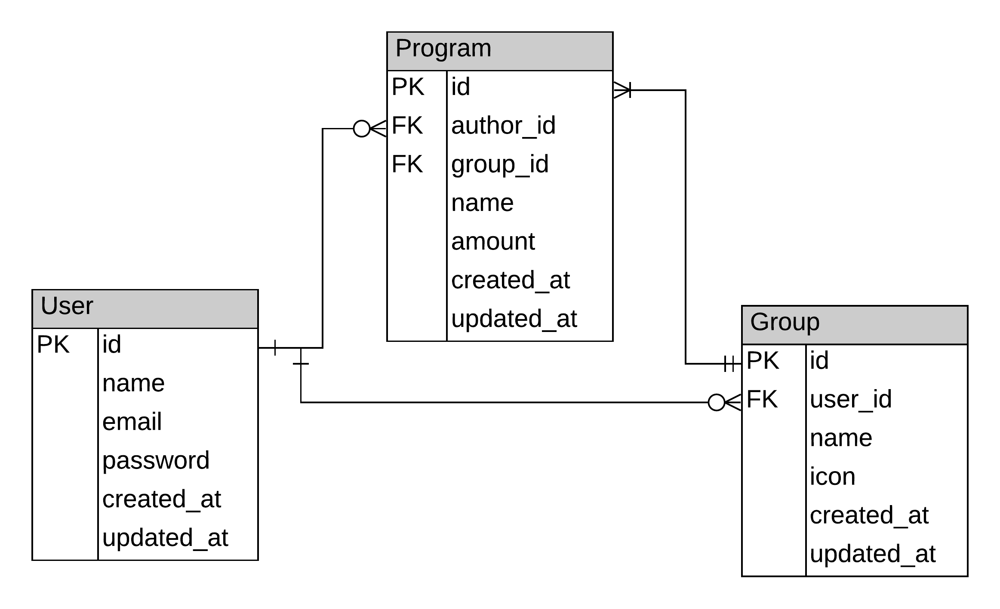

# Wotchd

<!-- <%= image_tag 'stephen-arnold.jpg', alt: "Mon image", width: 500, height: 500, class: "rounded" %> -->
<%= link_to 'Cancel', "", :onclick => "$('#form_id').submit()" %>
<%= gravatar_image_tag(@user.email, size: 200, alt: @user.name, class: 'mt-4') %>
<%= label_tag :picture, 'Upload picture', class: "" %>

npx stylelint "**/*.{css,scss}"
https://stylelint.io/user-guide/usage/cli#autofixing-errors


# Wotchd - a Twitter redesign project


This is the Capstone project for the Ruby on Rails Course

<hr />

<!--
*** Thanks for checking out this README Template. If you have a suggestion that would
*** make this better, please fork the repo and create a pull request or simply open
*** an issue with the tag "enhancement".
*** Thanks again! Now go create something AMAZING! :D
-->

<!-- PROJECT SHIELDS -->
<!--
*** I'm using markdown "reference style" links for readability.
*** Reference links are enclosed in brackets [ ] instead of parentheses ( ).
*** See the bottom of this document for the declaration of the reference variables
*** for contributors-url, forks-url, etc. This is an optional, concise syntax you may use.
*** https://www.markdownguide.org/basic-syntax/#reference-style-links
-->

[![Contributors][contributors-shield]][contributors-url]
[![Forks][forks-shield]][forks-url]
[![Stargazers][stars-shield]][stars-url]
[![Issues][issues-shield]][issues-url]

<!-- PROJECT LOGO -->
<br />
<p align="center">
  <a href="https://github.com/ericmbouwe/Wotchd">
    
  </a>
  
  <h3 align="center">Wotchd Application</h3>
  
  <p align="center">
    This project is part of the Microverse curriculum in Ruby On Rails course!
    <br />
    <a href="https://github.com/ericmbouwe/Wotchd"><strong>Explore the docs »</strong></a>
    <br />
    <br />
    <a href="">View Demo</a>
    <a href="https://github.com/ericmbouwe/Wotchd/issues">Report Bug</a>
    <a href="https://github.com/ericmbouwe/Wotchd/issues">Request Feature</a>
  </p>
</p>
  
Wotchd is based on a redesign of Twitter.  
Is an application to share Wotchd about books, politics, health etc - anything that you can share Wotchd about with people who follow you.  
  
Additionally to the requirements, I added the following features :  
  - User can check Likes to the Wotchd  
  - Users are presented in 4 modes   
    - All  
    - Most Friendly, those who follow many users  
    - Most Popular, those who are followed by many users  
    - Protagonists, those who have created many Wotchd  
  - Links are everywhere, to users, to Wotchd, to followings apply  

<!-- TABLE OF CONTENTS -->

## Table of Contents

- [Screen Shots](#application-screen-shots)
- [Video presentation](#video-presentation)
- [About the Project](#about-the-project)
- [N+1 Problem](#n+1-problem)
- [Entities Relationship Diagram](#erd)
- [Live Version](#live-version)
- [Application Instructions](#application-instructions)
- [System Requierments](#system-requierments)
- [Dependencies](#dependencies)
- [Configuration](#configuration)
- [Development](#development)
- [Testing](#testing)
- [Populate DB](#populate-database)
- [Built With](#built-with)
- [Contributors](#contributors)
- [Copy Rights](#copyright)
- [Acknowledgements](#acknowledgements)

<hr />

## Application Screen Shots

#### Sign Up


<hr />

#### Log In


<hr />

#### Wotchd - Home


<hr />

#### Users List


<hr />

#### Users Details


<hr />

#### Users Wotchd


<hr />

## Video presentation

  [View with Loom](https://www.loom.com/share/591511228ba74ea78ca4b46c2228f34e)

<hr />

<!-- ABOUT THE PROJECT -->

## About The Project

The project creates a database which holds 4 tables:

    - Users : Is the table containing the users' data  
      - Fields :  
        - string:   username  
        - string:   fullname 
        - datetime: created_at  
        - datetime: update_at  

    - Wotchd : is the table containing the Wotchd' data  
      - Fields:  
        - text:     text  
        - integer:  author_id  
        - datetime: created_at  
        - datetime: update_at  

    - Followings : Is the table that tracks users followings  
      - Fields  
        - integer: follower_id  
        - integer: followed_id  

    - Likes : Is the table that contains the users' likes on the Wotchd  
      - Fields  
        - integer: opinion_id  
        - integer: user_id  

Additionally 2 tables are created by the ActiveStorage to keep links to the users' images

  - active_storage_attachments
  - active_storage_blobs

<hr/>

## N+1 Problem

  The n+1 problem is encountered in this project into multiple case.  
  In order to avoid server's overhead, in some cases it has been solved by using aggregated SQL statements and in some other scopes of models.  

  #### Examples in Class User

  #### Aggregation examples

  ```

      def self.sort_by_friendly
        User.find_by_sql("SELECT users.id, users.username, users.fullname,
                                  count(flds.id) fd
                          FROM users
                          LEFT JOIN followings flds ON users.id = flds.follower_id
                          GROUP BY users.id, users.username, users.fullname
                          ORDER BY fd DESC")
      end

      def self.sort_by_popular
        User.find_by_sql("SELECT users.id, users.username, users.fullname,
                                  count(flrs.id) fr
                          FROM users
                          LEFT JOIN followings flrs ON users.id = flrs.followed_id
                          GROUP BY users.id, users.username, users.fullname
                          ORDER BY fr DESC")
      end

      def self.protagonists
        User.find_by_sql("SELECT users.id, users.username, users.fullname,
                                  count(Wotchd.id) Wotchd_count
                          FROM users
                          LEFT JOIN Wotchd ON users.id = Wotchd.author_id
                          GROUP BY users.id, users.username, users.fullname
                          ORDER BY Wotchd_count DESC")
      end

  ```
<hr/>

  #### Scope example

```
    scope :to_follow, ->(user) { where('id NOT IN (?)', user_followed(user)).filter { |f| f.id != user.id } }
```

<hr/>


## ERD



<hr/>

<!-- ABOUT THE PROJECT -->
## Live version

You can see it working [](https://Wotchd.herokuapp.com)

## Application Instructions

- New users must sign up and give a username, and a fullname  
- The user logs in to the app, only by typing the username  
- A logged in user can create Wotchd about anything, follow othe users and check likes on other users Wotchd  
- Has access to all other users' details including their followers and followings  

- There are three main page  
  - Wotchd (Home)  
  - Users with 4 sub-pages  
    - All - users sorted by their creation date  
    - Most Friendly - all users sorted by the number of other users that follow  
    - Most Popular - all users sorted by the number of followers  
    - Protagonists - all users sorted by the number of Wotchd they have created  
  - Profile with 4 sub-pages  
    - Details - the current user can edit their details  
    - Wotchd - listing those created by the viewed user  
    - Following - listing the users that the viewed user follows  
    - Followers - listing the followers of the viewed user  

- All Users lists show the numbers of followees, followers and Wotchd with clickable links to the relevant page and sub-page. The image of the user links to the selected user's profile-page. Also, at the bottom-right of user's image 2 arrows, one to the left and one to the right, signal the following and followed users.    

- All Wotchd lists show the opinion's author image linking to their profile and a clickable heart image allowing the current user to like-unlike each opinion.  

- The Right-Side-Bar  
  - The vertical bar at the right side  
    - In Home-page and Users-page shows a list of all users which the current user is not following, giving control to follow them by clicking an add-button to the right of each user  
    - In Profile-page lists the users that are following the viewed user. It provides the add-button for those that the current user is not following

- As required there are pages to Sign Up, to Log In and to Edit user's details  


<hr/>

## System Requierments

- Ruby
- Rails
- Yarn
- RSpec
- ActiveStorage
- Google Cloud Services

## Dependencies

- rspec-rails gem
- capybara gem
- selenium-webdriver gem
- chromedriver-helper gem

## Configuration

- first, clone the project
  Run

```
  git clone https://github.com/ericmbouwe/Wotchd.git
```

- Install the necessary dependancies
  Run

```
  rails active_storage:install
  rails db:migrate

  bundle install
  rails generate rspec:install
  yarn install
```

<hr/>

## Development

- Clone the project

```
  https://github.com/ericmbouwe/Wotchd.git
```

<hr/>

## Testing

- Tests have been included using RSpec for controllers, views and models
- Location /spec/tests/
- 5 test files
  - features_spec.rb  
  - following_spec.rb  
  - like_spec.rb  
  - opinion_spec.rb  
  - user_spec.rb    

#### Controller test files implement the views tests as well.

<hr/>

## Populate Database

To populate the database with sample data run :

```
  rails db:seed
```

<hr/>

## Built With

This project was built using these technologies.

- Ruby version 2.6
- Ruby On Rails version 6.0
- rspec
- capybara
- ActiveStorage
- Google Cloud Services
- Heroku

<hr/>

<!-- CONTACT -->

## Contributors

:bust_in_silhouette: **Author**

## Ioannis Kousis

- Github: [@ericmbouwe](https://github.com/ericmbouwe)
- Twitter: [@ericmbouwe](https://twitter.com/ericmbouwe)
- Linkedin: [Ioannis Kousis](https://www.linkedin.com/in/jgkousis)
- E-mail: jgkousis@gmail.com


<hr/>
<!-- ACKNOWLEDGEMENTS -->

## CopyRight

### Thanks to Gregoire Vella

 [Gregoire Vella on Behance](https://www.behance.net/gregoirevella)  
 [And his ideas](https://www.behance.net/gallery/14286087/Twitter-Redesign-of-UI-details)  

## Acknowledgements

- [Microverse](https://www.microverse.org/)
- [The Odin Project](https://www.theodinproject.com/)
- [Ruby Documentation](https://www.ruby-lang.org/en/documentation/)
- [Gregoire Vella](https://www.behance.net/gallery/14286087/Twitter-Redesign-of-UI-details)


<!-- MARKDOWN LINKS & IMAGES -->
<!-- https://www.markdownguide.org/basic-syntax/#reference-style-links -->

[contributors-shield]: https://img.shields.io/github/contributors/ericmbouwe/Wotchd.svg?style=flat-square
[contributors-url]: https://github.com/ericmbouwe/Wotchd/graphs/contributors
[forks-shield]: https://img.shields.io/github/forks/ericmbouwe/Wotchd.svg?style=flat-square
[forks-url]: https://github.com/ericmbouwe/Wotchd/network/members
[stars-shield]: https://img.shields.io/github/stars/ericmbouwe/Wotchd.svg?style=flat-square
[stars-url]: https://github.com/ericmbouwe/Wotchd/stargazers
[issues-shield]: https://img.shields.io/github/issues/ericmbouwe/Wotchd.svg?style=flat-square
[issues-url]: https://github.com/ericmbouwe/Wotchd/issues


