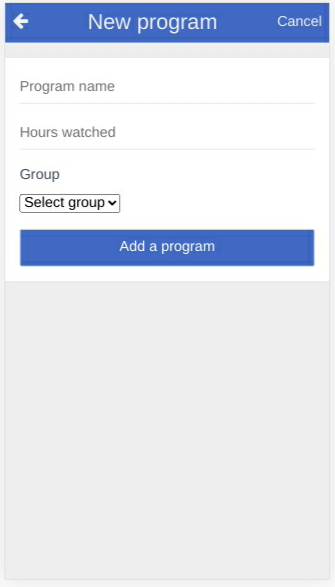

### Wotchd - a mobile application which groups your hours spent on watching entertainment TV Shows during the day, week or the month.


This is the Capstone project for the Ruby on Rails Course

<hr />

<!--
*** Thanks for checking out this README Template. If you have a suggestion that would
*** make this better, please fork the repo and create a pull request or simply open
*** an issue with the tag "enhancement".
*** Thanks again! Now go create something AMAZING! :D
-->

<!-- PROJECT SHIELDS -->
<!--
*** I'm using markdown "reference style" links for readability.
*** Reference links are enclosed in brackets [ ] instead of parentheses ( ).
*** See the bottom of this document for the declaration of the reference variables
*** for contributors-url, forks-url, etc. This is an optional, concise syntax you may use.
*** https://www.markdownguide.org/basic-syntax/#reference-style-links
-->

[![Contributors][contributors-shield]][contributors-url]
[![Forks][forks-shield]][forks-url]
[![Stargazers][stars-shield]][stars-url]
[![Issues][issues-shield]][issues-url]

<!-- PROJECT LOGO -->
<br />
<p align="center">
  <a href="https://github.com/ericmbouwe/Wotchd">
    
  </a>
  
  <h3 align="center">Wotchd Application</h3>
  
  <p align="center">
    This project is part of the Microverse curriculum in Ruby On Rails course!
    <br />
    <a href="https://github.com/ericmbouwe/Wotchd"><strong>Explore the docs »</strong></a>
    <br />
    <br />
    <a href="https://www.loom.com/share/a71195d54afb4c09a573309165389a0d">View Demo</a>
    <a href="https://github.com/ericmbouwe/Wotchd/issues">Report Bug</a>
    <a href="https://github.com/ericmbouwe/Wotchd/issues">Request Feature</a>
  </p>
</p>
  
Wotchd is a tracker app.  
It is an application to group and track your hours spent on watching your favorite TV Shows 
  
Additional features are :  
  - User can delete a program  
  - User can update a group and change its icon  

<!-- TABLE OF CONTENTS -->

## Table of Contents

- [Screen Shots](#application-screen-shots)
- [Video presentation](#video-presentation)
- [About the Project](#about-the-project)
- [N+1 Problem](#n+1-problem)
- [Entities Relationship Diagram](#erd)
- [Live Version](#live-version)
- [Application Instructions](#application-instructions)
- [System Requierments](#system-requierments)
- [Dependencies](#dependencies)
- [Configuration](#configuration)
- [Development](#development)
- [Testing](#testing)
- [Populate DB](#populate-database)
- [Built With](#built-with)
- [Contributors](#contributors)
- [Copy Rights](#copyright)
- [Acknowledgements](#acknowledgements)

<hr />

## Application Screen Shots

#### Wotchd - splash screen


<hr />

#### Sign Up


<hr />

#### Log In


<hr />

#### Wotchd - User Home


<hr />

#### Wotchd - New program


<hr />

#### Wotchd - My Programs


<hr />

#### Wotchd - My shuffled Programs


<hr />

#### Wotchd - New Group


<hr />

#### Wotchd - All Groups


<hr />

#### Wotchd - Group's Programs


<hr />


## Video presentation

  [View with Loom](https://www.loom.com/share/a71195d54afb4c09a573309165389a0d)

<hr />

<!-- ABOUT THE PROJECT -->

## About The Project

The project creates a database which holds 3 tables:

    - Users : Is the table containing the users' data  
      - Fields :  
        - string:   name  
        - string:   email  
        - string:   password  
        - datetime: created_at  
        - datetime: update_at  

    - Programs : is the table containing the programs' data  
      - Fields:  
        - string:   name  
        - integer:  amount  
        - integer:  author_id  
        - integer:  group_id    
        - datetime: created_at  
        - datetime: update_at  

    - Groups : Is the table to groups programs  
      - Fields  
        - string: name  
        - string: icon  
        - datetime: created_at  
        - datetime: update_at  

We have 2 tables created by the ActiveStorage to store users and groups avatars as well.

    - active_storage_attachments  
    - active_storage_blobs  

<hr/>

## N+1 Problem

  The n+1 problem encountered in this project is the association between a user, programs and groups (retrieve all the programs associated with a group or not of a user.)

  ```
    has_many :programs, -> { includes :group }, class_name: 'Program'
  ```

<hr/>

  #### Scope examples
  Exemples for Program class

```
  scope :no_group, -> { where group_id: nil }
  scope :daily, -> { where(created_at: Time.now.beginning_of_day..Time.zone.now) }
  scope :weekly, -> { where(created_at: Time.now.prev_day(days = 7)..Time.zone.now) }
  scope :monthly, -> { where(created_at: Time.now.prev_month(months = 1)..Time.zone.now) }
```

<hr/>


## ERD


<hr/>

<!-- ABOUT THE PROJECT -->
## Live version

You can see it working [](https://Wotchd.herokuapp.com)

## Application Instructions

- A guest user open the app and access the splash screen which display the logo and two buttons, login and sign up  
- You need to sign in with only your name if you already have an account or sign up in order to navigate through the app  
- When logged in,  
  - You can see all your programs and your shuffled programs by clicking on the appropriate buttons  
  - You can create a new program and add a group or not to it  
  - You can see all existing groups by clicking on the link 'All group' in the main page  
  - You can create a new group of programs by clicking on the green button in the bottom of the page ('All groups page')  
  - you can edit a group by clicking on the button in the top right corner of the group's show page  
- Click in the small sidebar in the user profile page to have a resume of your hours watched for the current day, the week (the last 7 days), and the month (the last 30 days)  
<hr/>

## System Requierments

- Ruby
- Rails
- Yarn
- RSpec
- ActiveStorage

## Dependencies

- gem 'rspec-rails'  
- gem 'capybara'  
- gem 'selenium-webdriver'  
- gem 'chromedriver-helper  
- gem 'bcrypt'  
- gem 'rack-cors'  
- gem 'factory_bot_rails'  
- gem 'rails-controller-testing'  
- gem 'faker'
- gem 'capybara'  
- gem 'guard-rspec'  
- gem 'launchy'  
- gem 'aws-sdk-s3'
- gem 'coderay'

## Configuration

- first, clone the project
  Run

```
  git clone https://github.com/ericmbouwe/Wotchd.git
```

- Install the necessary dependancies
  Run

```
  rails db:create
  rails active_storage:install
  rails db:migrate

  bundle install
  yarn install
```

<hr/>

## Development

- Clone the project

```
  https://github.com/ericmbouwe/Wotchd.git
```

<hr/>

## Testing
In order to run tests, run this command first

```
rails generate rspec:install
```
Then run  

- For full tests 
```
bundle exec rspec spec
```
-  For a specific model
```
 bundle exec rspec spec/models/{model_name}_spec.rb   
```
Unit and integration tests have been done using RSpec an Capybara
- Location ./spec/

<hr/>

## Built With

This project was built using these technologies.

- Ruby version 2.6
- Ruby On Rails version 6.0
- rspec
- capybara
- ActiveStorage
- Heroku
- Bootstrap 4
- AWS

<hr/>

<!-- CONTACT -->

## Contributors

:bust_in_silhouette: **Author**

## Eric Mbouwe

- Github: [@ericmbouwe](https://github.com/ericmbouwe)
- Twitter: [@ericmbouwe](https://twitter.com/ericmbouwe)
- Linkedin: [Eric Mbouwe](https://www.linkedin.com/in/ericmbouwe)
- E-mail: ericmbouwe@gmail.com


<hr/>
<!-- ACKNOWLEDGEMENTS -->

## CopyRight

### Thanks to Gregoire Vella

 [Gregoire Vella on Behance](https://www.behance.net/gregoirevella)  
 [And his ideas](https://www.behance.net/gallery/19759151/Snapscan-iOs-design-and-branding?tracking_source=), for the original design  

## Acknowledgements

- [Microverse](https://www.microverse.org/)
- [The Odin Project](https://www.theodinproject.com/)
- [Ruby Documentation](https://www.ruby-lang.org/en/documentation/)
- [Gregoire Vella](https://www.behance.net/gallery/19759151/Snapscan-iOs-design-and-branding?tracking_source=)


<!-- MARKDOWN LINKS & IMAGES -->
<!-- https://www.markdownguide.org/basic-syntax/#reference-style-links -->

[contributors-shield]: https://img.shields.io/github/contributors/ericmbouwe/Wotchd.svg?style=flat-square
[contributors-url]: https://github.com/ericmbouwe/Wotchd/graphs/contributors
[forks-shield]: https://img.shields.io/github/forks/ericmbouwe/Wotchd.svg?style=flat-square
[forks-url]: https://github.com/ericmbouwe/Wotchd/network/members
[stars-shield]: https://img.shields.io/github/stars/ericmbouwe/Wotchd.svg?style=flat-square
[stars-url]: https://github.com/ericmbouwe/Wotchd/stargazers
[issues-shield]: https://img.shields.io/github/issues/ericmbouwe/Wotchd.svg?style=flat-square
[issues-url]: https://github.com/ericmbouwe/Wotchd/issues

